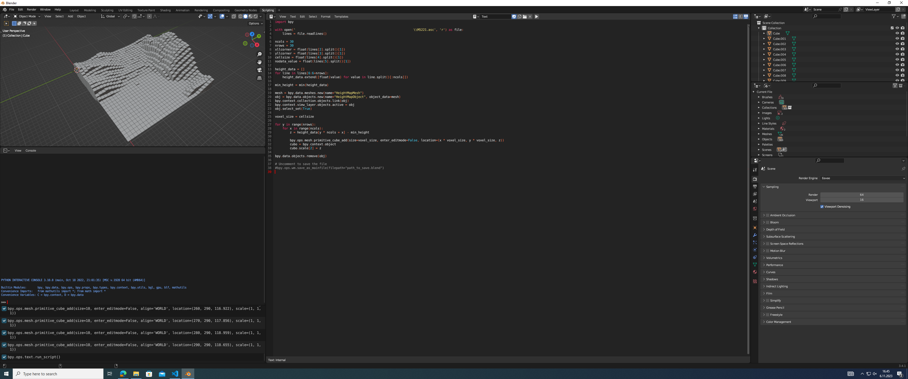

# My Python XAMK Course's Final Project in Blender
**By Rubén Castro González**  
  
**Objective:** In this project the objective is to represent the height data of Finland in Blender using a Python script.
## The requirements for this assignment are:

 - Developed Python script works in blender and uses blender python library.

 - Script reads the file.

 - Information is parsed from the file.

 - Code is documented.

 - There are no errors that prevent execution in the code.

 - Possible exceptions are handled.

 - Visualization is done by using blender python library and 3D space.

 - Be ready to explain your code and solution if asked.

## Tools that I am going to use:

 - [Blender 3.6](https://docs.blender.org/api/current/)
 - [Python 3.10.12](https://docs.python.org/release/3.10.12/)
 - Visual Studio Code
 - Git
 - GitHub
 - WSL with Ubuntu

## Process step by step:

We need to read a file like this one:

```
ncols        2400
nrows        1200
xllcorner    500000.000000000000
yllcorner    6834000.000000000000
cellsize     10.000000000000
NODATA_value  -9999.000

118.358 119.714 120.488 120.506 120.702 120.045 119.613 118.901 118.957 119.211 119.862 119.972 119.401  
118.595  116.338 115.550 114.283 114.190 114.190 114.190 114.190 114.190 114.190 114.190 114.190 114.190  
114.190 114.190 114.190 114.190 114.190 114.190 114.190 114.190 114.190 114.190 114.190 114.190 114.190  
114.190 114.190 114.190 114.190 114.190 114.190 114.190 114.190 114.190 114.190 114.190 114.190 114.190    
```
We are going to do two different approaches:

## Option 1:
>Create a python script for Blender that reads the map height data from the file ***M5221.asc*** and creates a simple height visualization of a part of the information.
#### For reading we can use this simple Python code:  
   

We open the file:
```python
with open('PATH\\M5221.asc', 'r') as file:
    lines = file.readlines()
```
Now we take the columns and rows we want changing them in the script (let's use 30 as example):
```python
ncols = 30 # Can be change
nrows = 30 # Can be change
```
We take the constraints provided in the .asc file for representing the data in Blender:
```python
xllcorner = float(lines[2].split()[1])
yllcorner = float(lines[3].split()[1])
cellsize = float(lines[4].split()[1])
nodata_value = float(lines[5].split()[1])
```
Now we read the rows and columns the user wanted to read:
```python
height_data = []
for line in lines[6:6+nrows]:
    height_data.extend([float(value) for value in line.split()[:ncols]])
```
At the end of the *for loop* we have the variable *height_data* with all the coordinates.

#### Now for the representation in Blender we can use this code:
  
Import the Blender library in python:
```python
import bpy
```
We adjust the minimum height at the minimum height in the data set for improve the representation:
```python
min_height = min(height_data)
```
Now we adjust the *voxels* size:
```python
voxel_size = cellsize
```
And we create the map using two *for* loops:
```python
for y in range(nrows):
    for x in range(ncols):
        z = height_data[y * ncols + x] - min_height # We use this formula for improve the map representation.
        
        bpy.ops.mesh.primitive_cube_add(size=voxel_size, enter_editmode=False, location=(x * voxel_size, y * voxel_size, z))
        cube = bpy.context.object
        cube.scale[2] = z
```
And we can save the Blender file if we want:
```python
bpy.ops.wm.save_as_mainfile(filepath="path_to_save.blend")
```

### This is the complete code and result:

#### Code
```python
import bpy

with open('PATH\\M5221.asc', 'r') as file:
    lines = file.readlines()

ncols = 30
nrows = 30
xllcorner = float(lines[2].split()[1])
yllcorner = float(lines[3].split()[1])
cellsize = float(lines[4].split()[1])
nodata_value = float(lines[5].split()[1])

height_data = []
for line in lines[6:6+nrows]:
    height_data.extend([float(value) for value in line.split()[:ncols]])

min_height = min(height_data)

voxel_size = cellsize

for y in range(nrows):
    for x in range(ncols):
        z = height_data[y * ncols + x] - min_height
        
        bpy.ops.mesh.primitive_cube_add(size=voxel_size, enter_editmode=False, location=(x * voxel_size, y * voxel_size, z))
        cube = bpy.context.object
        cube.scale[2] = z

# Uncomment to save the file
#bpy.ops.wm.save_as_mainfile(filepath="path_to_save.blend")
```

#### Result


## Option 2:
>Create a more advanced version of the blender script. Whole area covered in the file cannot be rendered by planes in a way that I have done in the first exercise example. Figure out how to render a larger area. Blender can manage a huge amount of vertexes. This 3d object in next screenshot for example contains 1 002 001 vertexes.

>Add also a menu component that can be used to define the rendered area. User can for example define north/west and south/east coordinates. 

#### For reading we can use this simple Python code:  
   

We open the file:
```python
with open('PATH\\M5221.asc', 'r') as file:
    lines = file.readlines()
```
Now we take the columns and rows we want changing them in the script (let's use 30 as example):
```python
ncols = 30 # Can be change
nrows = 30 # Can be change
```
We take the constraints provided in the .asc file for representing the data in Blender:
```python
xllcorner = float(lines[2].split()[1])
yllcorner = float(lines[3].split()[1])
cellsize = float(lines[4].split()[1])
nodata_value = float(lines[5].split()[1])
```
Now we read the rows and columns the user wanted to read:
```python
height_data = []
for line in lines[6:6+nrows]:
    height_data.extend([float(value) for value in line.split()[:ncols]])
```
At the end of the *for loop* we have the variable *height_data* with all the coordinates.

#### Now for the representation in Blender we can use this code:
  
Import the Blender library in python:
```python
import bpy
```
We create a new mesh and object in Blender:
```python
mesh = bpy.data.meshes.new(name="3DMapMesh")
obj = bpy.data.objects.new(name="3DMapObject", object_data=mesh)
```
We link the object to the current collection:
```python
bpy.context.collection.objects.link(obj)
```
We set it as the active object and we select it:
```python
bpy.context.view_layer.objects.active = obj
obj.select_set(True)
```
We can scale the object in the z axis for improve the map view:
```python
obj.scale = (1, 1, 1) # Change the numbers for scale the map (x,y,z)
```
We generate vertices and faces for a 3D mesh from height data:
```python
vertices = [(x * cellsize, y * cellsize, z - min(height_data)) for y in range(nrows) for x in range(ncols) for z in [height_data[y * ncols + x]]]
faces = [(i, i+1, i+ncols+1, i+ncols) for i in range(0, len(vertices)-ncols-1) if (i+1) % ncols != 0]
```
We create a mesh object from a set of vertices and faces and we update it:
```python
mesh.from_pydata(vertices, [], faces)
mesh.update()
```
With this the map is created but now we need to add a menu.

#### Now for the menu:

We will use this example code:

```python
import bpy
# bmesh library is used to handle 3D objects in memory - This should be used when 3d Objects are modified by using scripts
import bmesh

class MapDataProps(bpy.types.PropertyGroup):
    rows: bpy.props.IntProperty(name="Rows to read")
    columns: bpy.props.IntProperty(name="Columns to read")
    

class MapDataOperator(bpy.types.Operator):
    bl_idname = "object.map_data"
    bl_label = "Map Data Operator"

    def execute(self, context):
        print("Button clicked.")
        print(bpy.context.scene.MapDataProps.rows)
        print(bpy.context.scene.MapDataProps.columns)
        return {'FINISHED'}


class ReadMapDataPanel(bpy.types.Panel):
    #"""Creates a Panel in the Object properties window"""
    """Creates a Panel in the 3D window"""
    bl_label = "Read Map Data"
    #bl_idname = "OBJECT_PT_read_map_data"
    bl_idname = "VIEW3D_PT_map_data"
    #bl_space_type = "PROPERTIES"
    bl_space_type = "VIEW_3D"
    #bl_region_type = "WINDOW"
    bl_region_type = "UI"
    #bl_context = "object"
    bl_category = "Map Data"

    def draw(self, context):
        props = bpy.context.scene.MapDataProps
        layout = self.layout

        col = layout.column()

        row = col.row()
        row.prop(props, "rows")
        row.prop(props, "columns")
        row = col.row()
        row.operator("object.map_data")

def register():
    bpy.utils.register_class(MapDataProps)
    bpy.utils.register_class(MapDataOperator)
    bpy.utils.register_class(ReadMapDataPanel)
    bpy.types.Scene.MapDataProps = bpy.props.PointerProperty(type=MapDataProps)

def unregister():
    bpy.utils.unregister_class(ReadMapDataPanel)
    bpy.utils.unregister_class(MapDataOperator)
    bpy.utils.unregister_class(MapDataProps)
    del(bpy.types.Scene.MapDataProps)

if __name__ == "__main__":
    register()
    # This can be used to remove the menu.
    # unregister()
```
And we will change this few lines for execute our code instead of the example code:
```python
def execute(self, context):
        print("Button clicked.")
        print(bpy.context.scene.MapDataProps.rows)
        print(bpy.context.scene.MapDataProps.columns)
        return {'FINISHED'}
```
### This is the complete code and result:
#### Code
```python
import bpy

def create_map(rows,columns):
    with open('PATH\\M5221.asc', 'r') as file:
        lines = file.readlines()

    ncols = rows
    nrows = columns
    xllcorner = float(lines[2].split()[1])
    yllcorner = float(lines[3].split()[1])
    cellsize = float(lines[4].split()[1])
    #nodata_value = float(lines[5].split()[1])

    height_data = []
    for line in lines[6:6+nrows]:
        height_data.extend([float(value) for value in line.split()[:ncols]])

    mesh = bpy.data.meshes.new(name="3DMapMesh")
    obj = bpy.data.objects.new(name="3DMapObject", object_data=mesh)
    bpy.context.collection.objects.link(obj)
    bpy.context.view_layer.objects.active = obj
    obj.select_set(True)
    obj.scale = (1, 1, 1)

    vertices = [(x * cellsize, y * cellsize, z - min(height_data)) for y in range(nrows) for x in range(ncols) for z in [height_data[y * ncols + x]]]
    faces = [(i, i+1, i+ncols+1, i+ncols) for i in range(0, len(vertices)-ncols-1) if (i+1) % ncols != 0]

    mesh.from_pydata(vertices, [], faces)
    mesh.update()

class MapDataProps(bpy.types.PropertyGroup):
    rows: bpy.props.IntProperty(name="Rows")
    columns: bpy.props.IntProperty(name="Columns")
    

class MapDataOperator(bpy.types.Operator):
    bl_idname = "object.map_data"
    bl_label = "Render with this data"

    def execute(self, context):
        create_map(bpy.context.scene.MapDataProps.rows, bpy.context.scene.MapDataProps.columns)
        return {'FINISHED'}


class ReadMapDataPanel(bpy.types.Panel):
    #"""Creates a Panel in the Object properties window"""
    """Creates a Panel in the 3D window"""
    bl_label = "Render Menu"
    #bl_idname = "OBJECT_PT_read_map_data"
    bl_idname = "VIEW3D_PT_map_data"
    #bl_space_type = "PROPERTIES"
    bl_space_type = "VIEW_3D"
    #bl_region_type = "WINDOW"
    bl_region_type = "UI"
    #bl_context = "object"
    bl_category = "Map Menu"

    def draw(self, context):
        props = bpy.context.scene.MapDataProps
        layout = self.layout

        col = layout.column()

        row = col.row()
        row.prop(props, "rows")
        row.prop(props, "columns")
        row = col.row()
        row.operator("object.map_data")

def register():
    bpy.utils.register_class(MapDataProps)
    bpy.utils.register_class(MapDataOperator)
    bpy.utils.register_class(ReadMapDataPanel)
    bpy.types.Scene.MapDataProps = bpy.props.PointerProperty(type=MapDataProps)

def unregister():
    bpy.utils.unregister_class(ReadMapDataPanel)
    bpy.utils.unregister_class(MapDataOperator)
    bpy.utils.unregister_class(MapDataProps)
    del(bpy.types.Scene.MapDataProps)

if __name__ == "__main__":
    register()
    # This can be used to remove the menu.
    # unregister()
```
#### Result


## Conclusion
In this final project for the Python course in Blender, we've explored two approaches to represent Finland's height data in a three-dimensional environment using Blender and Python.

***Option 1*** offers a straightforward representation using cubes that visualize a section of the height data, providing an initial understanding of how the data can be mapped into a three-dimensional space.

On the other hand, ***Option 2*** expands the possibilities by presenting a more advanced solution. Apart from generating the three-dimensional representation of the data, it implements an interactive menu in Blender to define the area to be represented, offering a more flexible and adaptable experience.

By following the detailed steps outlined in this document, an effective representation of Finland's height data in Blender can be achieved, providing a solid foundation for development and understanding of data visualization in three-dimensional environments.

